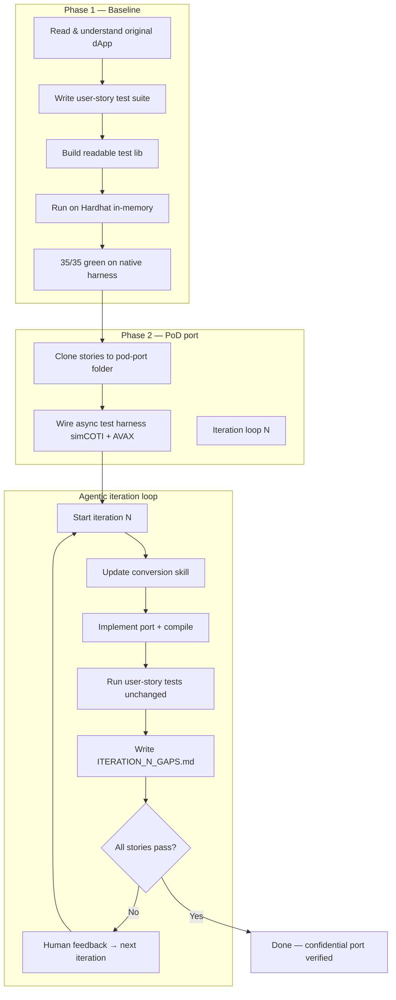

# Generic Algorithm to Make Any dApp Confidential (PoD Port)

This guide documents the **repeatable process** used to convert a production dApp into a **confidential PoD port** while preserving end-to-end user journeys. The reference implementation is **Sablier Merkle Instant payroll** → `sablier-payroll-pod/`.

**Outcome:** same user-story tests pass on the original dApp (Phase 1) and on the PoD port (Phase 2), with contracts/skills evolving across iterations until **100% story coverage**.

---

## Process overview



| Step | What | Artifact | Gate |
|------|------|----------|------|
| **1** | Create & validate use-case set for original dApp | `sablier-payroll/` + `docs/USER_STORIES.md` | All stories pass on **native** harness |
| **2** | Clone use-cases to pod-port | `sablier-payroll-pod/` (stories verbatim) | Stories copied; infra adapted only in `test/lib` |
| **3** | Agentic iteration loop | Contracts + skill + gap reports | Human feedback each iteration |
| **4** | Final state | PoD contracts + skills + eval docs | **Same** user stories pass on PoD port |

---

## Phase 1 — Baseline use-case suite (original dApp)

**Goal:** Establish a frozen verification contract. After the PoD port, **only** `test/lib` and contracts change — **never** story assertion logic.

### Layout (Sablier example)

```
pod-dapp-ports/
  sablier-payroll/          # Phase 1 — native dApp harness
    contracts/              # SablierMerkleInstantHarness + mocks
    test/stories/           # S01–S31 (35 tests)
    test/lib/               # merkle, scenario, actors, assertions
    docs/USER_STORIES.md
```

### Success gate

```bash
npm run test:sablier-payroll   # 35/35 on Hardhat in-memory
```

Each story documents three columns: **User** | **UI intent** | **Backend action** (what would happen if a full app existed).

---

## Phase 2 — PoD port folder

**Goal:** Same stories, async PoD backend, separate folder (do not mutate Phase 1).

### Layout (Sablier example)

```
pod-dapp-ports/
  sablier-payroll-pod/      # Phase 2 — PoD port
    contracts/              # PayrollCampaignFacade, Vault, COTI, etc.
    test/stories/           # verbatim copy from Phase 1
    test/lib/               # pod-scenario, campaign-facade, async mining
    docs/iterations/        # ITERATION_01_GAPS.md … ITERATION_N_GAPS.md
    docs/USER_STORIES_EVALUATION.md
```

### Infra requirements

- **simCOTI** + **Hardhat AVAX surrogate** (dual-chain, fast round-trip mining)
- Test lib wraps facade: `submitPayload` → `claim` → mine COTI → mine pToken → sync balances
- Stories still call plaintext `amount` in JS; lib builds `itUint256` before on-chain calls

### Success gate

```bash
npm run test:sablier-payroll-pod   # target: 35/35
```

---

## Agentic iteration algorithm

Run this loop until **all user stories pass** and documented gaps are acceptable for your privacy bar.

```
FOR iteration N = 1, 2, 3, …:

  1. START ITERATION N
     - Read ITERATION_{N-1}_GAPS.md (if N > 1)
     - Read human feedback from prior iteration

  2. UPDATE SKILL
     - Extend .cursor/skills/<dapp>-conversion/ with learnings
     - Document AVAX vs COTI split, messaging, visibility, patterns

  3. IMPLEMENT PORT
     - Change contracts + test/lib only
     - DO NOT change test/stories/* assertion logic

  4. VERIFY
     - sync-contracts.sh (if applicable)
     - npm run test:<pod-port>
     - Record pass count (e.g. 34/35 → fix → 35/35)

  5. GAP REPORT
     - Write docs/iterations/ITERATION_N_GAPS.md
     - List: fixed, remaining, skill updates, human decisions needed

  6. HUMAN FEEDBACK
     - Product/privacy corrections (e.g. funding model, amount leakage)
     - Feed into iteration N+1 prompt

  7. EXIT when stories == 100% AND privacy bar met
```

### Iteration themes (Sablier payroll reference)

| Iter | Focus | Result |
|------|-------|--------|
| 1 | Bootstrap facade, merkle commitments, story harness | 35/35 (sim sync path) |
| 2 | Full async COTI verify mine | Async claim path |
| 3 | Underfund guards, clawback | Edge cases |
| 4 | Claimant-submitted payloads | `PodClaimStore` |
| 5 | Encrypted pToken fund/payout/clawback | `ackPoolCredit` |
| 6 | Private amounts — `itUint256` calldata, no plaintext events | No amount leak |
| 7 | Encrypted pool `ge`, sim MPC parity on AVAX | S22 on-chain; 35/35 |

Gap reports: `sablier-payroll-pod/docs/iterations/ITERATION_*_GAPS.md`.

---

## Prompts used (verbatim from agent sessions)

Copy-paste these to start a new dApp port or the next iteration. Replace `<dapp>`, paths, and upstream URLs.

---

### Prompt 0 — Conversion skill (methodology only, no app build)

> We want to build a skill, where this application: https://github.com/sablier-labs/evm-monorepo/tree/main/airdrops/src can be converted to private payroll processing using this skill.
>
> We don't want to build the target application. But we want to have a skill, that can be used to convert this app to an async private. Partly on coti and part on AVAX.
>
> Note that converting an app to private is not straightforward. Every logic must be handled as a client-server model. The encrypted data can only be processed on COTI and the AVAX side encrypted data can only be used by UI (end-user encrypted)
>
> Important to understand who is supposed to see which data. We can use one-way messaging or two-way based on if we want the data to be back in AVAX.
>
> Many things like this that needs to be considered

**Follow-up (implement skill plan):**

> Sablier → Private Payroll Conversion Skill
>
> Implement the plan as specified, it is attached for your reference. Do NOT edit the plan file itself.
>
> To-do's from the plan have already been created. Do not create them again. Mark them as in_progress as you work, starting with the first one. Don't stop until you have completed all the to-dos.

---

### Prompt 1 — Phase 1: user-story baseline (native dApp)

> ok. Let's try this again from start:
>
> - We want to port the sablier payroll to PoD.
> - Let's create a specific folder for sablier. Everything goes there
> - Before start, we need to establish the success scenario as follows:
> - Read to understand the system completely.
> - Create a set of user-story tests. Each test, is meant to test sets of end-to-end user interaction.
> - These tests include what UI and backend would do if existed. For example, what would happen in the application
> - Create a set of testing lib that allows these user-story tests be simple and readable
> - Run everything in hardhat inmem node and run the tests to make sure we have a very good starting point. After port, all we need to do is to have the tests passing

---

### Prompt 2 — Phase 2: port + iteration loop definition

> Let's go to phase 2.
>
> The port. This is how we should build it:
> - New folder for the port. Don't change the existing one.
> - Copy all tests over, but update the testing infra to use the async nature of PoD and do a round trip mining after txs.
> - Use in memory simCOTI and hardhat node to simulate COTI and avax in a speedy fashion.
>
> Then use the following algorithm to achieve a working product:
> 1. Start iteration N. Create a skill for porting sablier contracts to PoD. Look at the existing contracts and PoD requirements, async nature, and what part goes on COTI vs avax and why
> 2. Generate the port. Compile and run User story tests. DO NOT change test logic to pass. The system should evolve but the user stories are for verification
> 3. Generate a report of iteration N of gaps
> 4. Go back to 1. Update the skill and loop
>
> Continue this algorithm until we are 100% covered with user stories

**Follow-up (implement Phase 2 plan):**

> Phase 2: PoD Payroll Port (`pod-payroll-port/`)
>
> Implement the plan as specified, it is attached for your reference. Do NOT edit the plan file itself.
>
> To-do's from the plan have already been created. Do not create them again. Mark them as in_progress as you work, starting with the first one. Don't stop until you have completed all the to-dos.

---

### Prompt 3 — Generic “next iteration”

> go ahead with the next iteration

Use when no specific theme — agent reads `ITERATION_{N-1}_GAPS.md` and continues.

---

### Prompt 4 — Human feedback iteration (funding model)

> S27 manual funding — mint threw; poolBalance zero after transfer; fixed with adapter mint → portalDepositTo and creditPoolTo after employer→facade transfer.
>
> Better approach is to fund one corporate account first with large amount of pTokens. Then transfer to employees after validation on chain. The contract does not need to interact with PrivacyPortal it only should interact with pToken.
>
> Continue with the next iteration

---

### Prompt 5 — Human feedback iteration (privacy: no plaintext amounts)

> In the API we can allow any amount to be encrypted. E.g. if API expects uint amount, itUint... is also acceptable.
>
> Run the next iteration and make public data private. No amount should leak to public

---

### Prompt 6 — Human feedback iteration (on-chain encrypted guards + sim parity)

> On-chain encrypted pool ge, onchain data can be ct. If the sim doesn't support it update the sim network to support it and be feature parity with actual COTI network.
>
> Fix the remaining gaps. Need to close all the features.
>
> Also update pod-payroll-port/docs/USER_STORIES_EVALUATION.md with latest changes.
>
> Let's run iteration 7

---

### Prompt template — New dApp (fill in blanks)

```markdown
We are porting <ORIGINAL_DAPP_NAME> to PoD.

Upstream: <URL to contracts / repo>

Phase 1 (if not done):
- Create folder <dapp-name>/ with user-story tests S01–SN
- Native harness on Hardhat in-memory; all stories must pass before porting

Phase 2:
- Create folder <dapp-name>-pod/ — copy stories verbatim, adapt test/lib only
- Use simCOTI + Hardhat AVAX surrogate for async mining
- Run iteration loop until SN/SN stories pass

Iteration N focus:
<Describe privacy gap, e.g. "encrypt all calldata amounts", "async payout only via pToken">

Constraints:
- DO NOT change test/stories assertion logic
- DO NOT decrypt on AVAX callbacks
- Document gaps in docs/iterations/ITERATION_N_GAPS.md
- Update .cursor/skills/<dapp>-conversion/ after each iteration

Run: npm run test:<dapp-pod>
Target: <N>/<N> passing
```

---

## Agent instructions (per iteration)

When the agent runs an iteration, it should:

1. **Read first**
   - Previous `ITERATION_*_GAPS.md`
   - `.cursor/skills/<dapp>-conversion/SKILL.md` and siblings
   - `docs/USER_STORIES.md` / `USER_STORIES_EVALUATION.md`

2. **Change only**
   - `contracts/` (port contracts)
   - `test/lib/` (scenario, facade wrapper, async helpers)
   - Skills and gap docs
   - **Not** `test/stories/*` (except rare ABI shape fixes agreed with human)

3. **PoD architecture rules** (from conversion skill)
   - **AVAX = client** — submit inbox requests, hold pToken pool, forward `itUint*` + opaque handles
   - **COTI = server** — MPC verify, private comparisons, garbled balances
   - **UI = encryption boundary** — builds ITs; decrypts balances off-chain
   - **Async** — mined tx ≠ paid; poll `hasClaimed` + balance sync
   - **Messaging** — one-way for register-only; two-way when result must return to AVAX

4. **Deliver each iteration**
   - Green or improved test count
   - `ITERATION_N_GAPS.md`
   - Updated skill notes
   - Optional: `USER_STORIES_EVALUATION.md` refresh

5. **Run tests**

   ```bash
   bash <port>/scripts/sync-contracts.sh    # if contracts symlinked to monorepo
   npm run test:<port-name>
   ```

---

## Confidentiality checklist (any dApp)

Use per iteration to track privacy bar:

| Surface | Public dApp | PoD target |
|---------|-------------|------------|
| Amounts in calldata | Plaintext `uint` | `itUint256` |
| Amounts in storage | Plaintext | `ct` / commitments only |
| Amounts in events | Plaintext | hashes / commitments |
| Merkle leaves | `hash(index, recipient, amount)` | `hash(index, recipient, commitment)` |
| Payout | `safeTransfer` | encrypted `pToken.transfer` |
| Verify | Same-chain | COTI `eq` / MPC on ciphertext |
| Pool / balance checks | `balanceOf` plaintext | encrypted ledger + `checkedSub` |
| Sim | N/A | MPC precompile on **all** chains facade uses |

---

## Skills & docs map (Sablier reference)

| Path | Role |
|------|------|
| `pod-dapp-ports/.cursor/skills/pod-sablier-payroll-conversion/` | How to convert (methodology) |
| `pod-dapp-ports/.cursor/skills/pod-sablier-payroll-port/` | How to run/maintain the port |
| `sablier-payroll/docs/USER_STORIES.md` | Story index (Phase 1) |
| `sablier-payroll-pod/docs/USER_STORIES_EVALUATION.md` | Native vs PoD per story |
| `sablier-payroll-pod/docs/iterations/` | Per-iteration gap reports |
| `sablier-payroll-pod/docs/AIRDROP_CAMPAIGN_UI_CHECKLIST.md` | UI build scope vs Sablier Airdrops |

For other dApps: copy skill folder → rename → fill `fork-decisions.md`, `visibility-matrix.md`, `sablier-instant-mapping.md` equivalent.

---

## Exit criteria

The port is **done** when:

- [ ] Phase 1: all native user stories pass (`sablier-payroll/`)
- [ ] Phase 2: **same count** of user stories pass on PoD port (`sablier-payroll-pod/`)
- [ ] No story files were weakened (assertions unchanged)
- [ ] Documented privacy bar met (see `USER_STORIES_EVALUATION.md`)
- [ ] Final `ITERATION_N_GAPS.md` lists only production/deployment gaps (or empty)
- [ ] Conversion skill updated with all iteration learnings

**Sablier payroll current state:** 35/35 Phase 1 and Phase 2; iteration 7 closed encrypted pool + sim MPC parity.

---

## Quick start (new dApp)

```bash
# 1. Phase 1
mkdir -p pod-dapp-ports/<my-dapp>/{contracts,test/stories,test/lib,docs}
# Write USER_STORIES.md, implement native harness, npm test → N/N

# 2. Phase 2
cp -r pod-dapp-ports/<my-dapp>/test/stories pod-dapp-ports/<my-dapp>-pod/test/
# Implement PoD contracts + test/lib; wire simCOTI

# 3. Iteration 1
# Paste Prompt 2 + Prompt template with your dApp details

# 4. Loop
# Paste Prompt 3 or themed prompts (4–6) until N/N green
```

---

## Related repositories

- `pod-dapp-ports/` — ports monorepo (this doc)
- `pod-ecosystem-integration/` — simCOTI harness, portal tests, contract sync
- `coti-contracts/` / `coti-pod-inbox-contracts/` — PoD primitives (Inbox, pToken, MPC)
