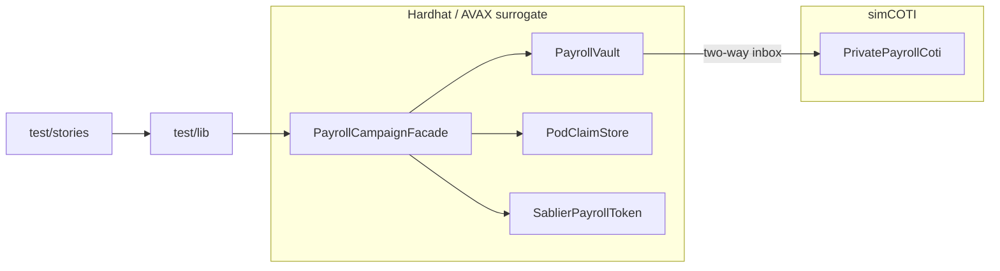

# Architecture — PoD Payroll Port

## Split

## Claim flow (iteration 8 — PoD client facade)

1. `freshCampaign` builds PoD merkle tree, deploys facade, registers leaves on COTI + facade
2. Fund: public `pToken.transfer` + `requestCreditPool` → COTI `creditPool`
3. `claimPackage` / `preparePayload` sets `PodClaimStore` with verify `itUint256` + `proofHandle`
4. Facade `_preProcessClaim` (time, fee, merkle only — no local MpcCore)
5. Facade `requestPayout` → inbox two-way to COTI; `ClaimInstant` emitted in same tx
6. `runCrossChainTwoWayRoundTrip` mines COTI `verifyAndCredit` (eq + pool deduct + plain amount)
7. Vault `onPayoutAuthorized` → `facade.payoutTo(to, uint256)` + `markClaimed`

## Merkle spec

See `docs/MERKLE_POD.md` and `test/lib/merkle.ts`.
