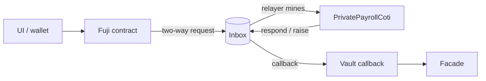
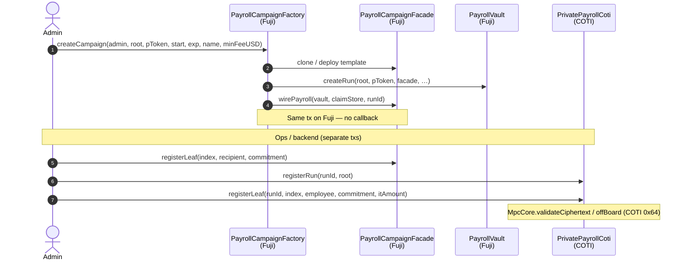
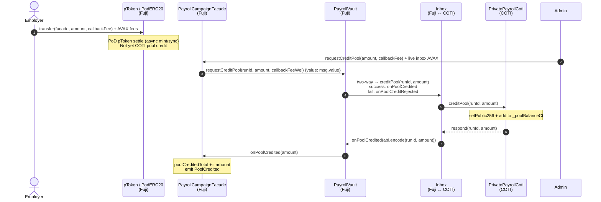
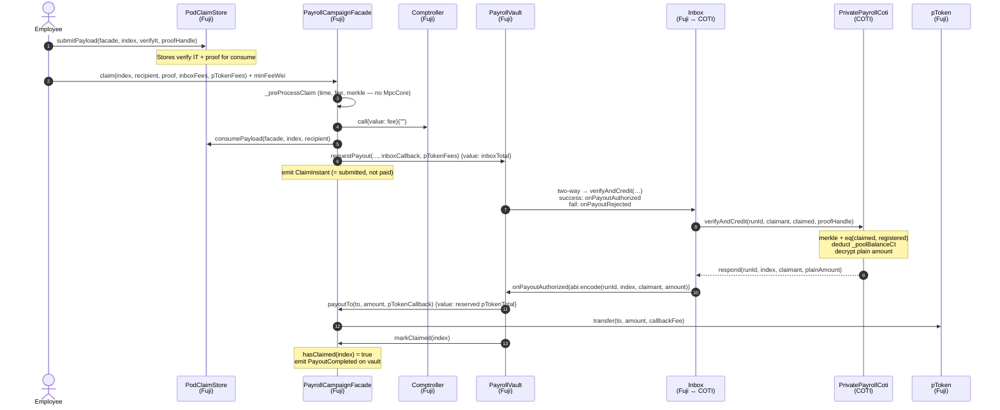
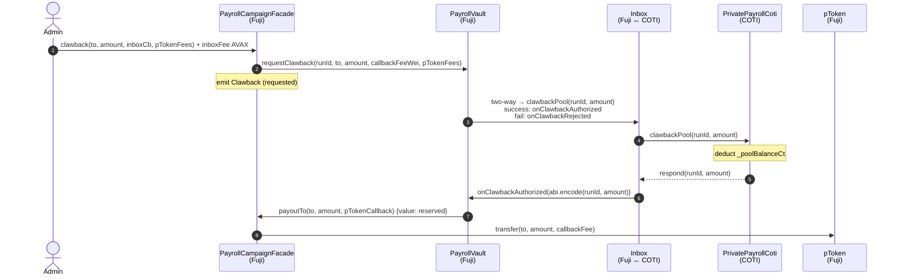
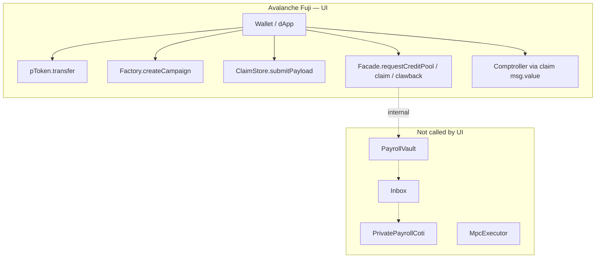

# User flows — networks, contracts, callbacks

Iteration 08 thin Fuji facade. **UI only talks to Fuji.** Encrypted pool MPC runs on COTI via the two-way inbox.

| Network | Role | Contracts |
|---------|------|-----------|
| Avalanche Fuji (`43113`) | PoD client | `pToken`, `PayrollCampaignFactory`, `PayrollCampaignFacade`, `PayrollVault`, `PodClaimStore`, `Comptroller`, `Inbox` |
| COTI testnet (`7082400`) | MPC server | `PrivatePayrollCoti`, `Inbox` (same address), `MpcExecutor` (relayer) |

Inbox pattern for every async path: Fuji vault → `Inbox` two-way → COTI method → `inbox.respond` / `inbox.raise` → Fuji vault **callback** → facade.

---

## Legend

---

## 1. Create campaign (admin / ops)

No inbox. Fuji factory clones + wires; ops then registers leaves on both chains.

| Step | Network | Contract.call | Callback? |
|------|---------|---------------|-----------|
| Create | Fuji | `Factory.createCampaign` → `Vault.createRun` + `Facade.wirePayroll` | No |
| Register Fuji leaf | Fuji | `Facade.registerLeaf` | No |
| Register COTI run/leaf | COTI | `PrivatePayrollCoti.registerRun` / `registerLeaf` | No (direct owner tx) |

---

## 2. Fund campaign (employer / admin)

Public pToken move on Fuji, then encrypted pool credit on COTI.

### Callback map (fund)

| Direction | Selector | Who calls | Payload |
|-----------|----------|-----------|---------|
| Request | `PrivatePayrollCoti.creditPool` | Inbox → COTI | `runId`, `amount` |
| Success callback | `PayrollVault.onPoolCredited` | Inbox → Vault | `(runId, amount)` |
| Then | `Facade.onPoolCredited` | Vault → Facade | `amount` |
| Fail callback | `PayrollVault.onPoolCreditRejected` | Inbox → Vault | `(runId, 0, errorCode)` |

UI poll: `facade.poolCreditedTotal()` (and/or `PoolCredited` event).

---

## 3. Claim (employee)

Fuji: merkle + fee + claimStore. COTI: verify amount + deduct pool. Fuji callback: public payout.

### Callback map (claim)

| Direction | Selector | Who calls | Payload |
|-----------|----------|-----------|---------|
| Request | `PrivatePayrollCoti.verifyAndCredit` | Inbox → COTI | `runId`, `claimant`, `it/gt amount`, `proofHandle` |
| Success callback | `PayrollVault.onPayoutAuthorized` | Inbox → Vault | `(runId, index, claimant, plainAmount)` |
| Then | `Facade.payoutTo` → `pToken.transfer` | Vault → Facade → pToken | public `uint256` amount |
| Then | `Facade.markClaimed` | Vault → Facade | `index` |
| Fail callback | `PayrollVault.onPayoutRejected` | Inbox → Vault | `(runId, index, errorCode)` |

`ClaimInstant` ≠ paid. Paid when vault `PayoutCompleted` / `hasClaimed` + pToken balance sync.

---

## 4. Clawback (admin)

Same two-way shape as fund, but COTI deducts pool and Fuji pays out to admin-chosen `to`.

### Callback map (clawback)

| Direction | Selector | Who calls | Payload |
|-----------|----------|-----------|---------|
| Request | `PrivatePayrollCoti.clawbackPool` | Inbox → COTI | `runId`, `amount` |
| Success callback | `PayrollVault.onClawbackAuthorized` | Inbox → Vault | `(runId, amount)` |
| Then | `Facade.payoutTo` → `pToken.transfer` | Vault → Facade → pToken | public amount to `to` |
| Fail callback | `PayrollVault.onClawbackRejected` | Inbox → Vault | `(runId, 0, errorCode)` |

---

## 5. Master callback matrix

| User flow | Fuji entry | Inbox request (COTI) | Success callback (Fuji) | Fail callback (Fuji) | Facade follow-up |
|-----------|------------|----------------------|-------------------------|----------------------|------------------|
| Fund | `Facade.requestCreditPool` | `creditPool` | `Vault.onPoolCredited` | `Vault.onPoolCreditRejected` | `Facade.onPoolCredited` |
| Claim | `Facade.claim` / `claimTo` | `verifyAndCredit` | `Vault.onPayoutAuthorized` | `Vault.onPayoutRejected` | `payoutTo` + `markClaimed` |
| Clawback | `Facade.clawback` | `clawbackPool` | `Vault.onClawbackAuthorized` | `Vault.onClawbackRejected` | `payoutTo` |

All three register success/fail selectors at send time via `_sendTwoWayWithFee(..., successSelector, rejectSelector)`.

---

## 6. Who the UI calls (and who it never calls)

---

## Related

- [`ARCHITECTURE.md`](./ARCHITECTURE.md)
- [`iterations/ITERATION_08_GAPS.md`](./iterations/ITERATION_08_GAPS.md)
- Skill: `pod-ecosystem-integration/.cursor/skills/pod-sablier-payroll-ui/`
